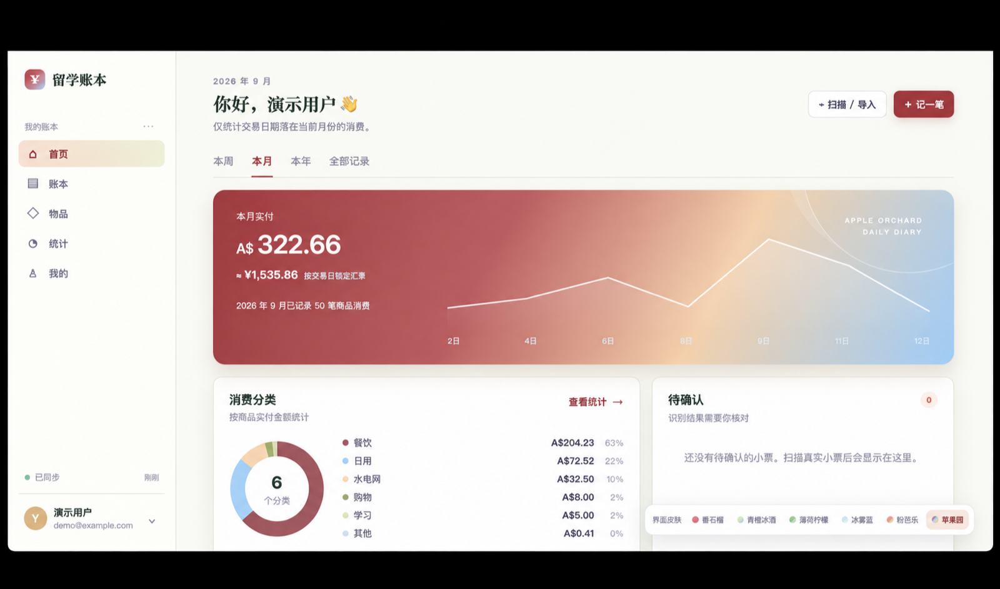
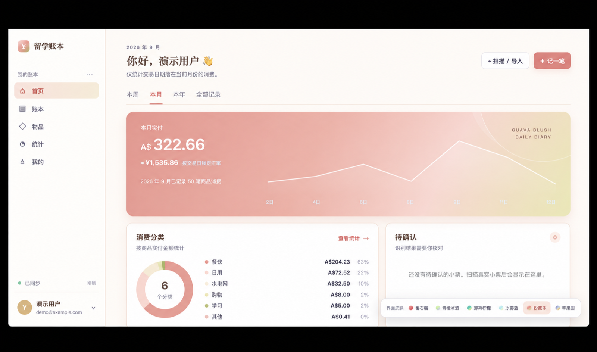
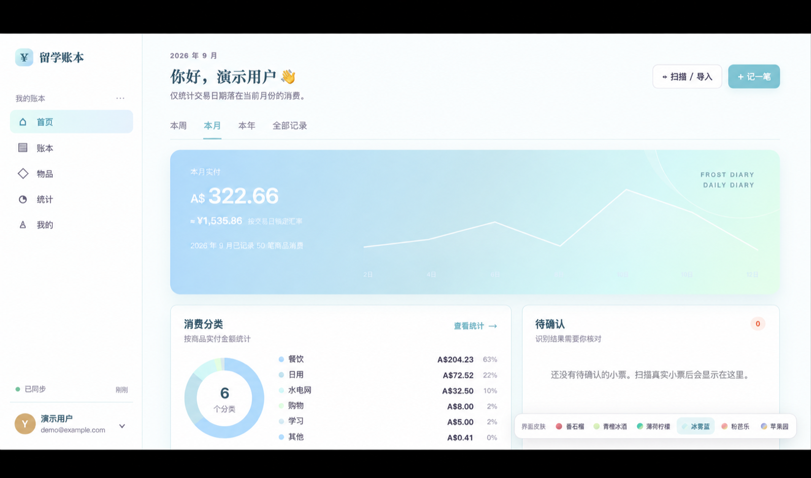
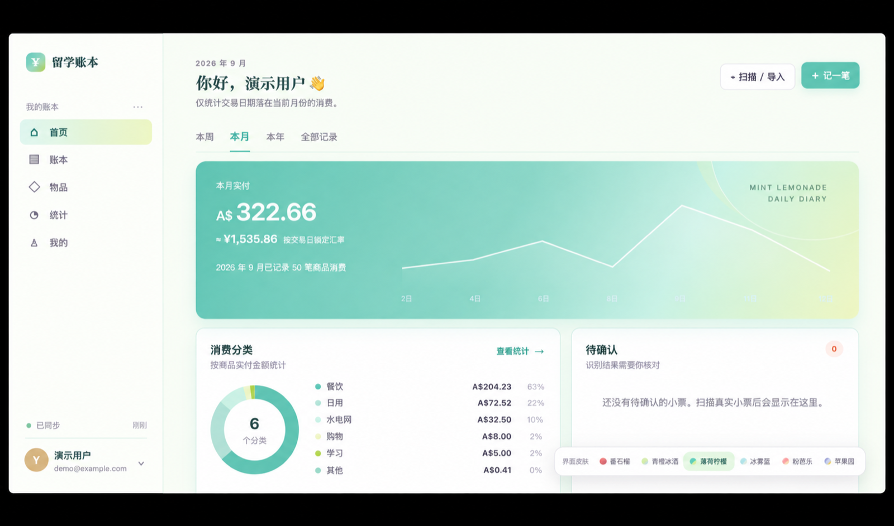
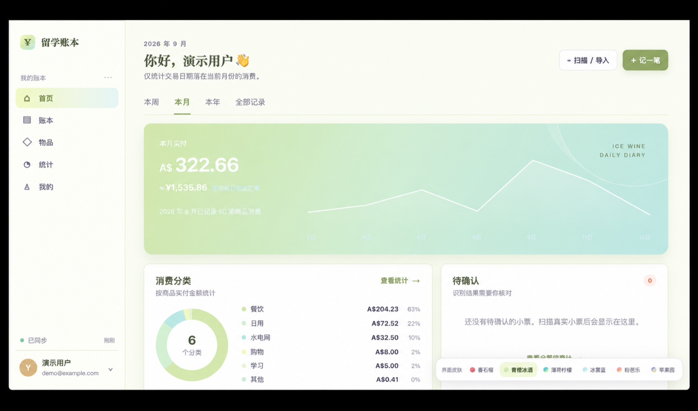
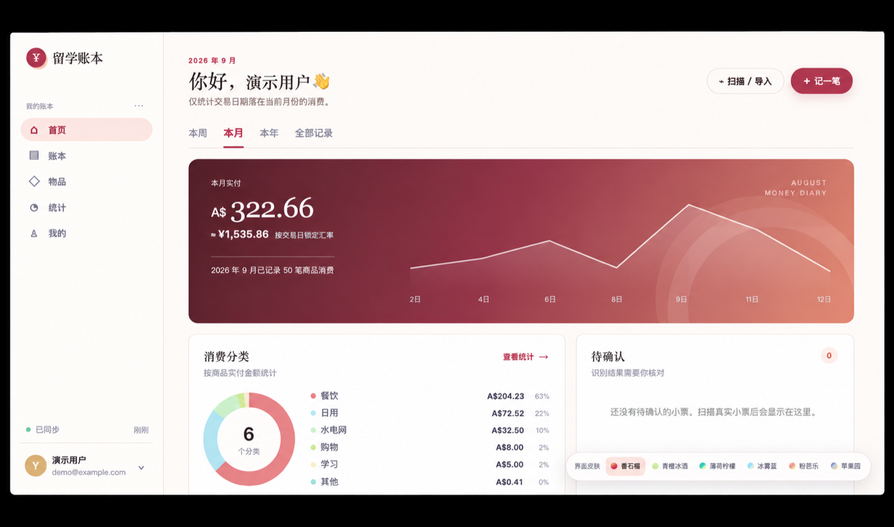
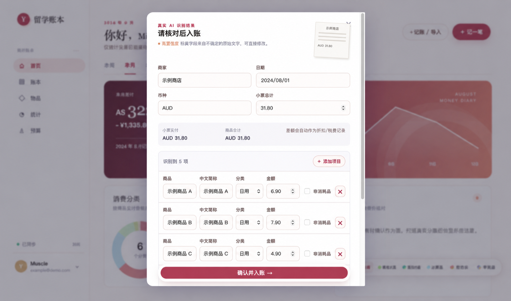
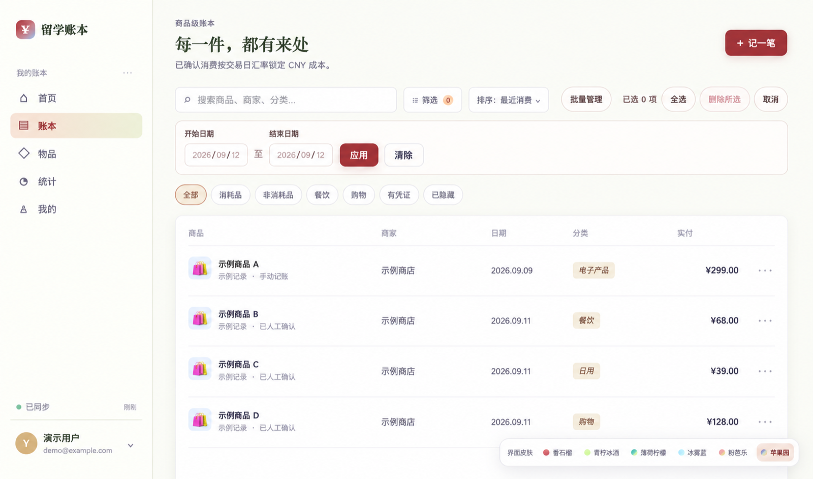
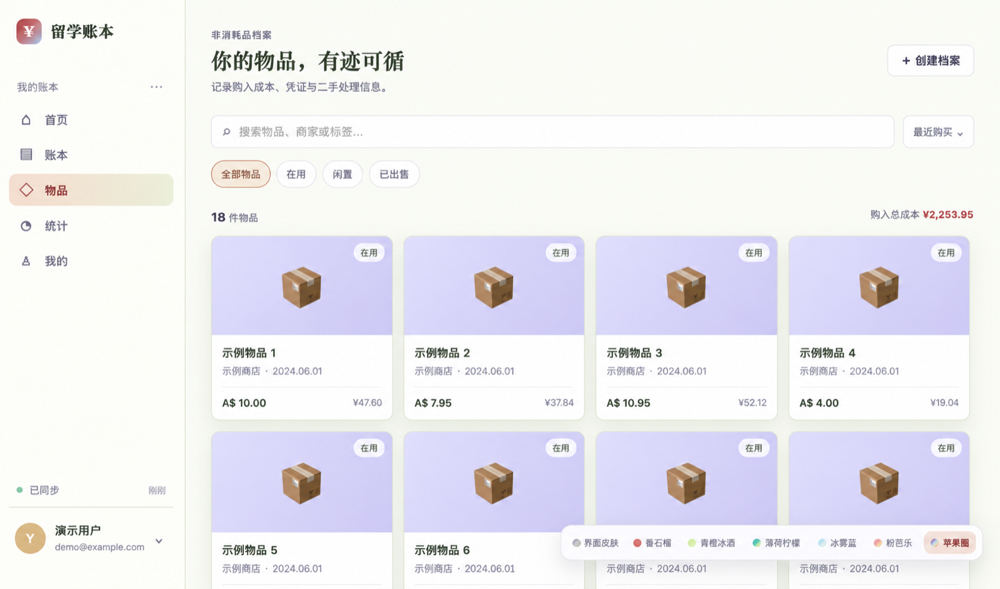
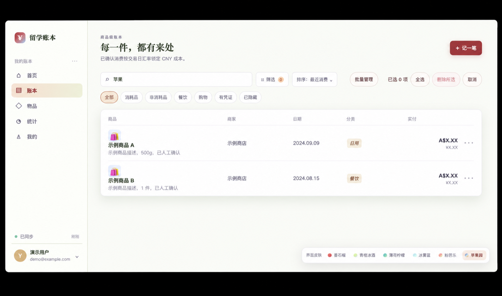

# 留学账本 · Spending Diary

一款面向留学生的 AI 消费记账与非消耗品档案工具。支持拍照或上传小票、逐项核对识别结果、按交易日统计支出，并把耐用品沉淀为可追溯的物品档案。

[在线体验](https://liuxue-spending-diary.liuxue-spending-diary.workers.dev/) · Cloudflare Workers / D1 / R2 · OpenAI 视觉识别

## 界面皮肤

用户可以随时切换 6 款配色，账目和设置不会受到影响。

| 苹果园 | 粉芭乐 |
| --- | --- |
|  |  |

| 冰雾蓝 | 薄荷柠檬 |
| --- | --- |
|  |  |

| 青橙冰酒 | 番石榴 |
| --- | --- |
|  |  |

## 核心功能

### AI 小票识别与人工复核

识别商家、日期、币种、总额及逐项商品信息；入账前可以修改中文简称、分类和金额，也可以补充或删除项目。服务端会核对商品数量与金额，减少漏记和重复记账。



### 商品级账本管理

每件商品独立入账，支持关键词、分类、日期范围等筛选，以及多选和批量删除。外币金额按交易日汇率锁定人民币成本。



### 非消耗品档案

可将耐用品标记为非消耗品，保留购入成本、凭证和状态，形成独立的物品档案。



### 搜索与追溯

支持按商品名、中文简称、商家或分类搜索，快速定位历史消费记录。



## 其他能力

- 游客可先体验，达到使用门槛后再登录，游客账目会同步到账号
- 支持手机拍照、相册上传以及桌面端拖拽导入
- 支持自定义消费分类和多商品手动记账
- 提供周、月、年和全部记录统计视图
- 原始小票保存于 R2，业务数据保存于 D1

## 本地开发

在项目目录安装依赖并启动本地环境：

```bash
pnpm install
pnpm run dev:local
```

然后打开 `http://localhost:8787`。本地模式使用独立的 D1、R2 模拟数据，不会读取或改动 Cloudflare 线上账本；修改前端和 Worker 文件后会自动重新构建。

小票 AI 识别仍会调用 Cloudflare Workers AI 绑定。若只需要检查真实 Cloudflare 绑定而不想发布，可运行：

```bash
pnpm run preview:cloudflare
```

这个模式会读取 Cloudflare 的真实资源，因此不要用它测试注册、记账或删除等写入操作。

### 更强的小票识别（可选）

默认的本地模式使用 Workers AI 的视觉模型。若要启用更强的 OpenAI 视觉识别，以及对缩写或不确定商品名的联网检索，在本机 `.dev.vars` 中添加自己的 `OPENAI_API_KEY`。请勿提交这个文件或将密钥写入前端代码。

服务端会以小票的 `items/subtotal` 单位数、商品金额合计和最终总价做交叉校验。多件商品会按实际件数记录，负数促销行会作为折扣保留；校验不一致时，确认页会提供可编辑项目，避免静默少记。

## 发布

确认本地效果后，先运行预检：

```bash
pnpm run check:cloudflare
```

确认无误再正式发布：

```bash
pnpm run deploy:cloudflare
```

生产环境的会话密钥由 Cloudflare Secret 管理，`.dev.vars` 不会被上传或提交。
